# NewsSnap: LLMOps AG News Classification Platform

<p align="left">
  
  
  
  
  
  
  
  
</p>

<p align="left">
  
  
  
</p>

## Live Demo

<p align="left">
  <a href="https://newssnap.onrender.com/" target="_blank">
    
  </a>
  <a href="https://newssnap.onrender.com/health" target="_blank">
    
  </a>
  <a href="https://newssnap.onrender.com/docs" target="_blank">
    
  </a>
</p>

> Free Render note: first load/prediction after idle can take longer due cold start. Once awake, responses are much faster.
>
> Public demo behavior: the hosted Render app may run **demo inference mode** (to avoid shipping large model weights on free hosting), but it can still display **real training/evaluation metrics** sourced from saved artifacts.

## Abstract
NewsSnap is an end-to-end MLOps implementation for AG News classification into four classes: `World`, `Sports`, `Business`, and `Sci/Tech`.
It includes local-first training and evaluation, a production-style FastAPI inference service with validation and rate limiting, and an interactive React dashboard for real-time testing.

The design goal is practical research-to-product workflow: reproducible local experiments first, with optional AWS/SageMaker/Terraform paths for cloud deployment.

## Highlights
- Local pipeline: ingestion -> preprocessing -> training -> evaluation.
- DistilBERT text classifier with reproducible configuration (`config.py`).
- FastAPI inference with schema validation and request throttling.
- Dashboard with live prediction view and confidence breakdown.
- CI/CD workflows for quality checks, ML pipeline, and Terraform automation.

## Product Showcase

<p align="center">
  <a href="Images/insights-overview.png">
    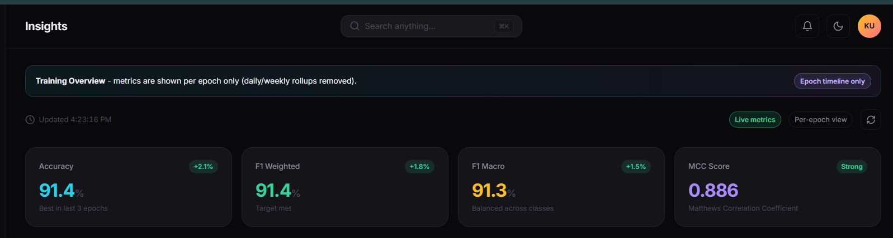
  </a>
</p>

<p align="center"><strong>Insights Dashboard:</strong> epoch-focused metrics, live/demo status, and clean operational telemetry.</p>

| Training Intelligence | Model Testing |
|---|---|
| <a href="Images/training-charts.png">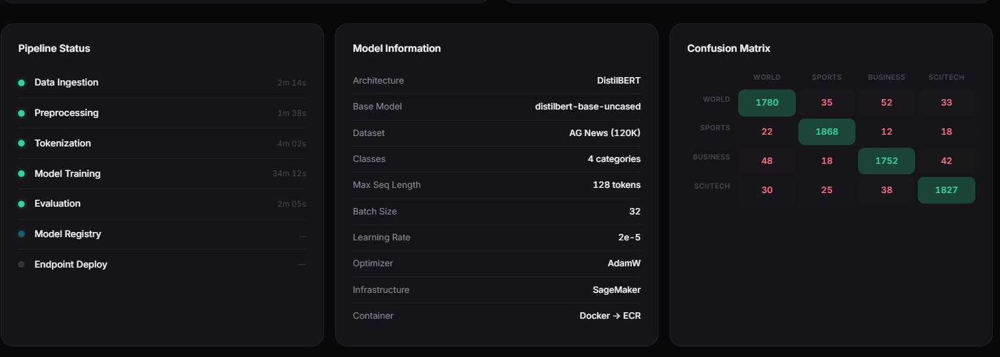</a><br/><sub>Loss convergence + PR curve view</sub> | <a href="Images/test-model-input.png">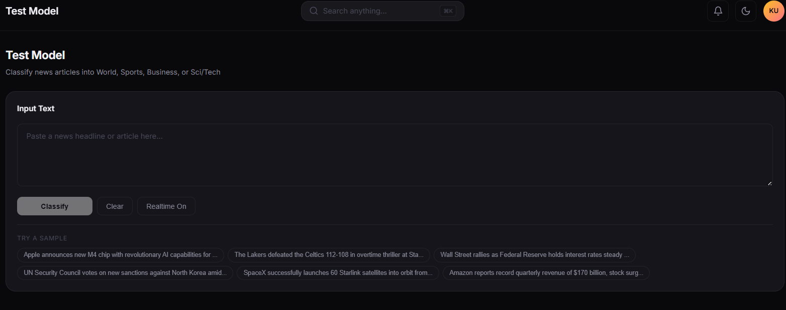</a><br/><sub>Interactive headline classification UX</sub> |
| <a href="Images/pipeline-confusion-matrix.png">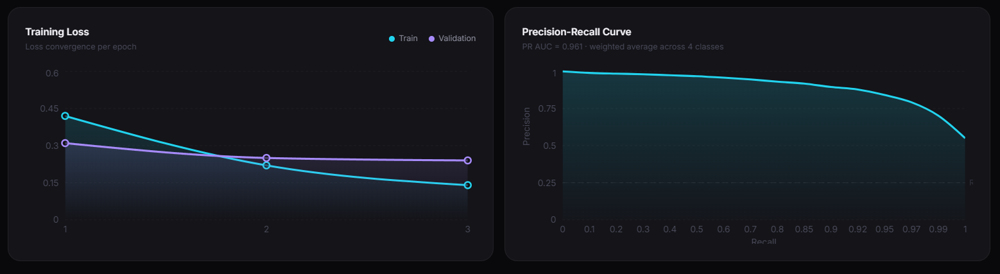</a><br/><sub>Pipeline health + confusion matrix diagnostics</sub> | <a href="Images/data-pipeline-overview.png">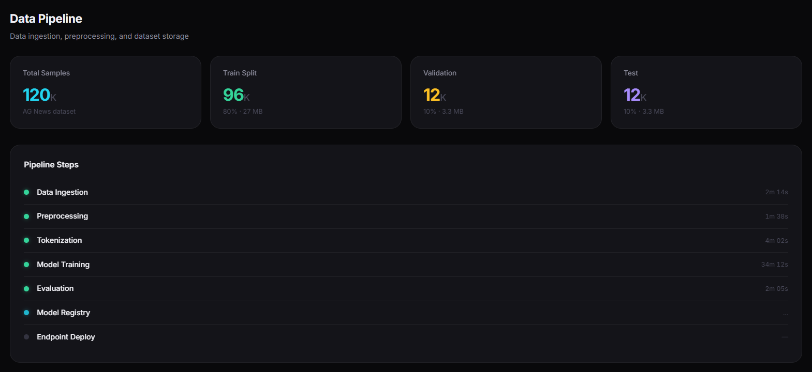</a><br/><sub>Dataset split and processing timeline</sub> |

| Infrastructure Views | Delivery & Ops |
|---|---|
| <a href="Images/endpoints-overview.png">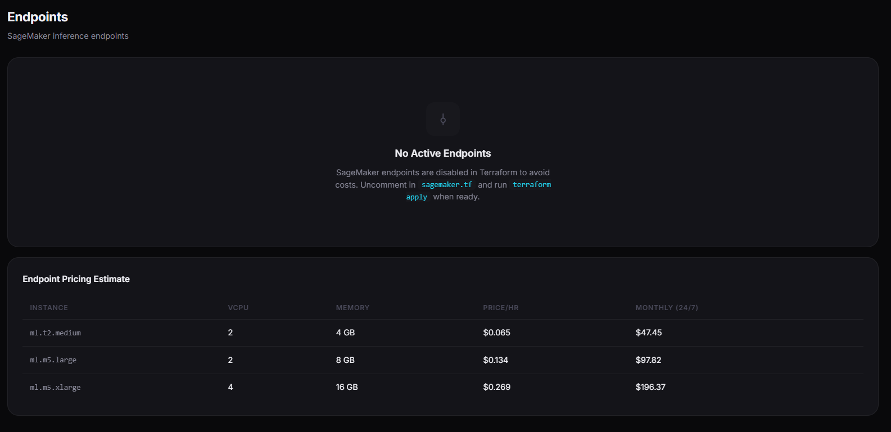</a><br/><sub>Endpoint readiness and cost estimates</sub> | <a href="Images/provisioned-resources.png">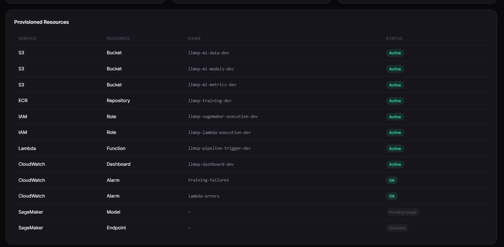</a><br/><sub>AWS resource inventory and status</sub> |
| <a href="Images/s3-storage-table.png">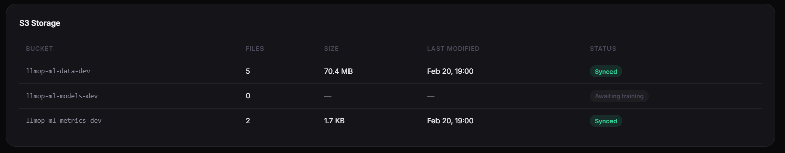</a><br/><sub>Storage state across data/model/metrics buckets</sub> | <a href="Images/settings-cicd.png">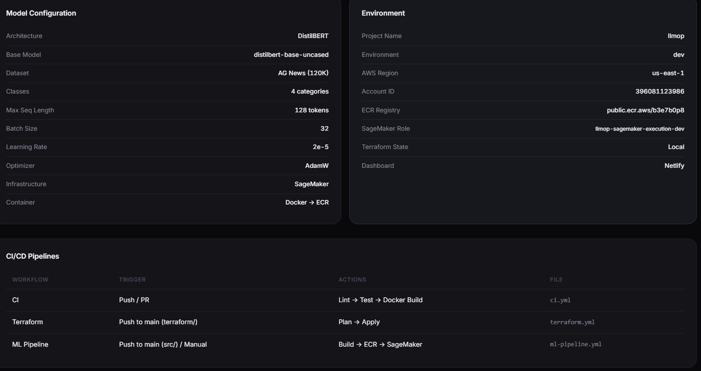</a><br/><sub>Environment, model config, and pipeline wiring</sub> |

## Measured Results
### Evaluation Snapshot
Source: `models/latest/evaluation_results.json` (timestamp `2026-02-21T04:29:44.346151`)

| Metric | Value |
|---|---:|
| Accuracy | 0.8699 |
| F1 (Weighted) | 0.8692 |
| F1 (Macro) | 0.8692 |
| MCC | 0.8270 |
| Test Samples | 12,000 |

### Class-wise Metrics
| Class | Precision | Recall | F1 | Support |
|---|---:|---:|---:|---:|
| World | 0.8292 | 0.8983 | 0.8624 | 3000 |
| Sports | 0.9482 | 0.9697 | 0.9588 | 3000 |
| Business | 0.8606 | 0.7963 | 0.8272 | 3000 |
| Sci/Tech | 0.8417 | 0.8153 | 0.8283 | 3000 |

### Training Snapshot
Source: `models/latest/training_history.json`

| Epoch | Train Loss | Train Acc | Val Loss | Val Acc | Val F1 |
|---:|---:|---:|---:|---:|---:|
| 1 | 1.1816 | 0.6582 | 0.9204 | 0.9141 | 0.9135 |

### Dataset and Artifact Footprint
| Item | Value |
|---|---:|
| Train split (`data/processed/train.jsonl`) | 96,000 |
| Validation split (`data/processed/val.jsonl`) | 12,000 |
| Test split (`data/processed/test.jsonl`) | 12,000 |
| Model artifact (`models/latest/model.safetensors`) | 267,838,720 bytes (~255.4 MB) |

## System Architecture
### End-to-End Flow
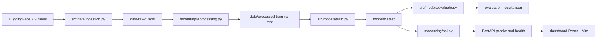

### Runtime Inference Path
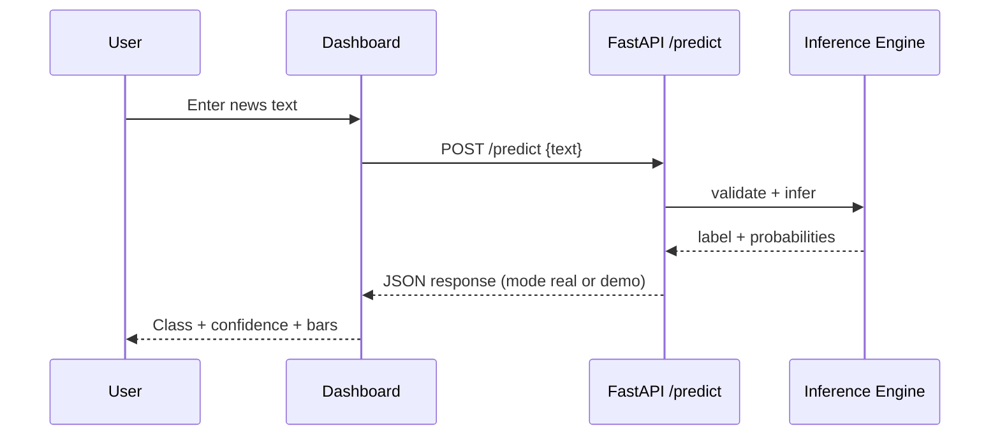

### DevOps Workflow Topology
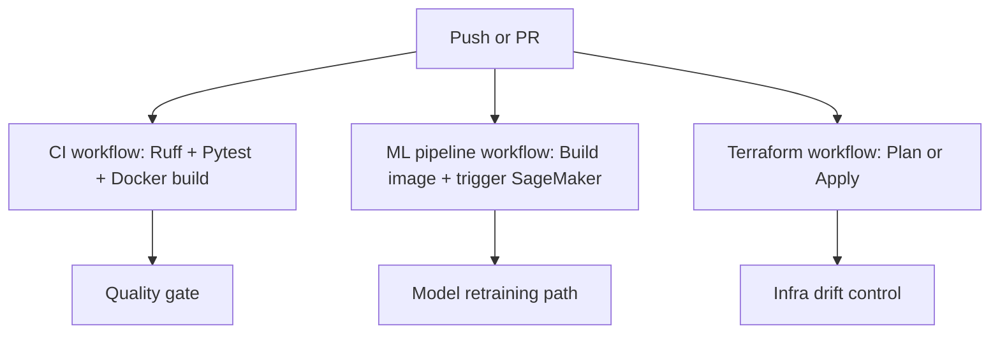

## Repository Layout
```text
.
|- src/
|  |- data/            # ingestion + preprocessing
|  |- models/          # training + evaluation
|  |- serving/         # FastAPI service + inference handlers
|  |- utils/           # logging, validation, rate limiting
|- scripts/
|  |- run_local_pipeline.py
|- dashboard/          # React + Vite UI
|- tests/              # unit + API behavior tests
|- terraform/          # optional cloud infrastructure
|- models/latest/      # local trained artifacts + metrics
|- .github/workflows/  # CI, ML pipeline, Terraform automation
```

## Quick Start (Local First)
### 1) Install dependencies
```bash
pip install -r requirements.txt
cd dashboard && npm install && cd ..
```

### 2) Run complete local pipeline
Fast local run (subsampled):
```bash
py scripts/run_local_pipeline.py
```

Full-data run:
```bash
py scripts/run_local_pipeline.py --max-train-samples 0 --max-val-samples 0 --epochs 3 --batch-size 32
```

### 3) Start API
```bash
py -m uvicorn src.serving.api:app --host 127.0.0.1 --port 8000
```

Health check:
```bash
curl http://127.0.0.1:8000/health
```

### 4) Start dashboard
```bash
cd dashboard
npm run dev -- --host 127.0.0.1 --port 5173
```
Open `http://127.0.0.1:5173`.

## API Contract
### `POST /predict`
Request:
```json
{
  "text": "Apple announces new AI chip for laptops"
}
```

Response (shape):
```json
{
  "predictions": [
    {
      "text": "...",
      "label": "Sci/Tech",
      "confidence": 0.91,
      "probabilities": {
        "World": 0.02,
        "Sports": 0.01,
        "Business": 0.06,
        "Sci/Tech": 0.91
      },
      "model": "distilbert-base-uncased",
      "latency_ms": 12.3
    }
  ],
  "mode": "real",
  "model_dir": "models/latest"
}
```

## Why You May See Demo Mode
`Demo Mode` on the Test Model page means the backend could not load `models/latest` model weights and fell back to the built-in heuristic classifier.

Common reasons:
- Free/cloud deployment does not include the large model artifact (`model.safetensors`).
- The backend has no S3 model download configuration.
- The model failed to load due memory/startup constraints.

How to verify:
```bash
curl https://<your-app>/health
```
If it returns `"mode":"demo"`, inference is fallback mode.

### Run Real Inference Locally (Free)
If your local `models/latest/` folder exists, the same app can run real inference from your laptop:
```bash
npm run build --prefix dashboard
py -m uvicorn src.serving.api:app --host 0.0.0.0 --port 8000
curl http://127.0.0.1:8000/health
```
Expected: `"mode":"real"`

### Metrics Endpoints (actual saved metrics)
The backend exposes saved experiment metrics (if present):
- `GET /metrics/latest_evaluation.json`
- `GET /metrics/latest_metrics.json`

The dashboard reads these endpoints by default and falls back to demo metrics only if they are unavailable.

## Testing and Quality
Run test suite:
```bash
py -m pytest -q
```

Latest local test run: `22 passed in 9.58s`.

## Free Deployment (Recommended)
### Option A: Render (single URL: frontend + API)
This repo now includes `render.yaml` and `Dockerfile.render` for full-stack deployment on one free web service.

[](https://render.com/deploy?repo=https://github.com/Zinga18018/NewsSnap)

Or manual setup:
1. Create new Web Service from this repo on Render.
2. Use `Dockerfile.render`.
3. Wait for deploy, then open:
   - `https://<your-render-service>/health`
4. Open `https://<your-render-service>/` for the dashboard.
5. Classify directly (no `VITE_API_URL` needed because frontend and API share the same domain).

### Option B: Railway (API only)
This repo includes `Procfile`.
Set start command (if prompted):
```bash
uvicorn src.serving.api:app --host 0.0.0.0 --port $PORT
```

### Option C: Hugging Face Spaces (free tier path, API only)
This repo includes `Dockerfile.space` and `requirements-space.txt` for a Docker Space.

1. Create a new Hugging Face Space.
2. Select `Docker` SDK.
3. Link your GitHub repo (or push files directly).
4. In Space Variables/Secrets set:
   - `MODEL_DIR=models/latest`
   - `S3_BUCKET_MODELS=llmop-ml-models-dev`
   - `MODEL_S3_PREFIX=public/models/latest`
   - `AWS_ACCESS_KEY_ID=<your-key>` (Secret)
   - `AWS_SECRET_ACCESS_KEY=<your-secret>` (Secret)
   - `AWS_DEFAULT_REGION=us-east-1`
5. Set Dockerfile path to `Dockerfile.space` if prompted.
6. After build completes, test:
   - `https://<your-space-subdomain>.hf.space/health`

The API now supports optional startup download of model artifacts from S3.
If those secrets are present, the Space can run in `real` mode automatically.

### Important mode note
If no `models/latest` artifact exists on the deployed backend, API runs in `demo` mode by design.
To verify mode:
```bash
curl https://<your-backend>/health
```

## Vercel Deployment (Dashboard, optional)
This repository includes `vercel.json` for building the Vite app from `dashboard/`.

1. Import repository into Vercel.
2. Deploy.
3. In Project Settings -> Environment Variables, set:
   - `VITE_API_URL` = your backend base URL (example: `https://your-api-domain.com`)
4. Redeploy after setting env vars.

### Common Production Error
If you see `API returned 405`, your frontend is likely calling itself instead of your backend.

Set `VITE_API_URL` to the backend base URL only:
- Correct: `https://<your-backend-domain>`
- Incorrect: `https://<your-vercel-frontend-domain>`
- Incorrect: `https://<your-backend-domain>/predict`

## Reproducibility Notes
- Default label mapping is fixed (`World`, `Sports`, `Business`, `Sci/Tech`).
- Split generation uses stratification and deterministic random seed defaults.
- Training/evaluation artifacts are stored under `models/latest/`.
- Configuration is centralized in `config.py` with environment variable overrides.

## Optional AWS Path
AWS resources (S3, SageMaker, Terraform) are optional.
You can run training, evaluation, API, and dashboard fully local without cloud spend.

## Roadmap
- Add experiment tracking (MLflow or W&B).
- Add model calibration and thresholding analysis.
- Add quantization/distillation variants for lower-latency inference.
- Add online drift monitoring and alerting.

## Acknowledgments
- AG News dataset (HuggingFace Datasets)
- HuggingFace Transformers
- FastAPI and React ecosystem
