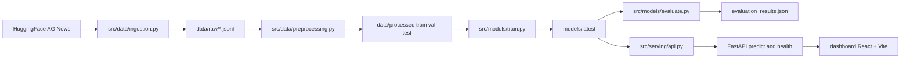
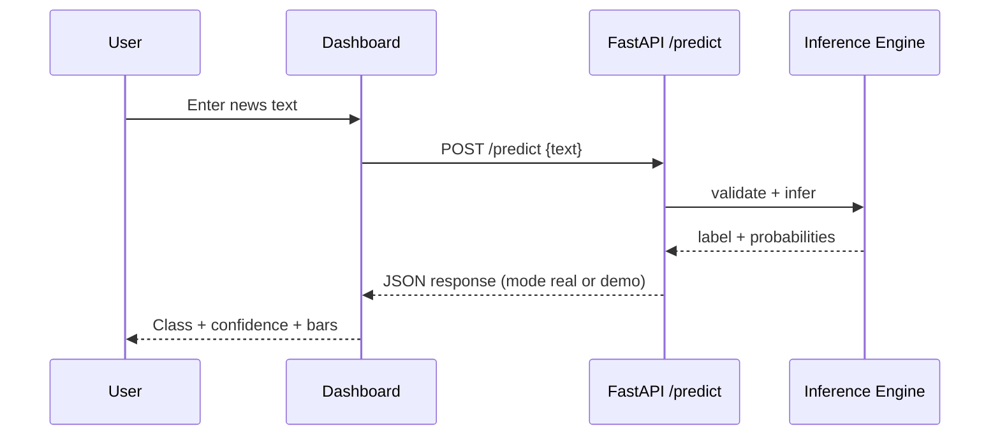
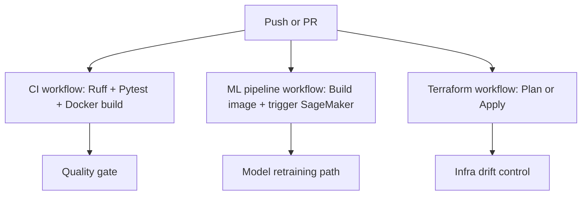

# NewsSnap: LLMOps AG News Classification Platform

<p align="left">
  
  
  
  
  
  
  
  
</p>

<p align="left">
  
  
  
</p>

## Abstract
NewsSnap is an end-to-end MLOps implementation for AG News classification into four classes: `World`, `Sports`, `Business`, and `Sci/Tech`.
It includes local-first training and evaluation, a production-style FastAPI inference service with validation and rate limiting, and an interactive React dashboard for real-time testing.

The design goal is practical research-to-product workflow: reproducible local experiments first, with optional AWS/SageMaker/Terraform paths for cloud deployment.

## Highlights
- Local pipeline: ingestion -> preprocessing -> training -> evaluation.
- DistilBERT text classifier with reproducible configuration (`config.py`).
- FastAPI inference with schema validation and request throttling.
- Dashboard with live prediction view and confidence breakdown.
- CI/CD workflows for quality checks, ML pipeline, and Terraform automation.

## Measured Results
### Evaluation Snapshot
Source: `models/latest/evaluation_results.json` (timestamp `2026-02-21T04:29:44.346151`)

| Metric | Value |
|---|---:|
| Accuracy | 0.8699 |
| F1 (Weighted) | 0.8692 |
| F1 (Macro) | 0.8692 |
| MCC | 0.8270 |
| Test Samples | 12,000 |

### Class-wise Metrics
| Class | Precision | Recall | F1 | Support |
|---|---:|---:|---:|---:|
| World | 0.8292 | 0.8983 | 0.8624 | 3000 |
| Sports | 0.9482 | 0.9697 | 0.9588 | 3000 |
| Business | 0.8606 | 0.7963 | 0.8272 | 3000 |
| Sci/Tech | 0.8417 | 0.8153 | 0.8283 | 3000 |

### Training Snapshot
Source: `models/latest/training_history.json`

| Epoch | Train Loss | Train Acc | Val Loss | Val Acc | Val F1 |
|---:|---:|---:|---:|---:|---:|
| 1 | 1.1816 | 0.6582 | 0.9204 | 0.9141 | 0.9135 |

### Dataset and Artifact Footprint
| Item | Value |
|---|---:|
| Train split (`data/processed/train.jsonl`) | 96,000 |
| Validation split (`data/processed/val.jsonl`) | 12,000 |
| Test split (`data/processed/test.jsonl`) | 12,000 |
| Model artifact (`models/latest/model.safetensors`) | 267,838,720 bytes (~255.4 MB) |

## System Architecture
### End-to-End Flow


### Runtime Inference Path


### DevOps Workflow Topology


## Repository Layout
```text
.
|- src/
|  |- data/            # ingestion + preprocessing
|  |- models/          # training + evaluation
|  |- serving/         # FastAPI service + inference handlers
|  |- utils/           # logging, validation, rate limiting
|- scripts/
|  |- run_local_pipeline.py
|- dashboard/          # React + Vite UI
|- tests/              # unit + API behavior tests
|- terraform/          # optional cloud infrastructure
|- models/latest/      # local trained artifacts + metrics
|- .github/workflows/  # CI, ML pipeline, Terraform automation
```

## Quick Start (Local First)
### 1) Install dependencies
```bash
pip install -r requirements.txt
cd dashboard && npm install && cd ..
```

### 2) Run complete local pipeline
Fast local run (subsampled):
```bash
py scripts/run_local_pipeline.py
```

Full-data run:
```bash
py scripts/run_local_pipeline.py --max-train-samples 0 --max-val-samples 0 --epochs 3 --batch-size 32
```

### 3) Start API
```bash
py -m uvicorn src.serving.api:app --host 127.0.0.1 --port 8000
```

Health check:
```bash
curl http://127.0.0.1:8000/health
```

### 4) Start dashboard
```bash
cd dashboard
npm run dev -- --host 127.0.0.1 --port 5173
```
Open `http://127.0.0.1:5173`.

## API Contract
### `POST /predict`
Request:
```json
{
  "text": "Apple announces new AI chip for laptops"
}
```

Response (shape):
```json
{
  "predictions": [
    {
      "text": "...",
      "label": "Sci/Tech",
      "confidence": 0.91,
      "probabilities": {
        "World": 0.02,
        "Sports": 0.01,
        "Business": 0.06,
        "Sci/Tech": 0.91
      },
      "model": "distilbert-base-uncased",
      "latency_ms": 12.3
    }
  ],
  "mode": "real",
  "model_dir": "models/latest"
}
```

## Testing and Quality
Run test suite:
```bash
py -m pytest -q
```

Latest local test run: `22 passed in 9.58s`.

## Vercel Deployment (Dashboard)
This repository includes `vercel.json` for building the Vite app from `dashboard/`.

1. Import repository into Vercel.
2. Deploy.
3. In Project Settings -> Environment Variables, set:
   - `VITE_API_URL` = your backend base URL (example: `https://your-api-domain.com`)
4. Redeploy after setting env vars.

### Common Production Error
If you see:
`API URL not configured. Set VITE_API_URL in Vercel project settings and redeploy.`

That means the dashboard is deployed without `VITE_API_URL`. Add the variable, redeploy, then hard refresh.

## Reproducibility Notes
- Default label mapping is fixed (`World`, `Sports`, `Business`, `Sci/Tech`).
- Split generation uses stratification and deterministic random seed defaults.
- Training/evaluation artifacts are stored under `models/latest/`.
- Configuration is centralized in `config.py` with environment variable overrides.

## Optional AWS Path
AWS resources (S3, SageMaker, Terraform) are optional.
You can run training, evaluation, API, and dashboard fully local without cloud spend.

## Roadmap
- Add experiment tracking (MLflow or W&B).
- Add model calibration and thresholding analysis.
- Add quantization/distillation variants for lower-latency inference.
- Add online drift monitoring and alerting.

## Acknowledgments
- AG News dataset (HuggingFace Datasets)
- HuggingFace Transformers
- FastAPI and React ecosystem
